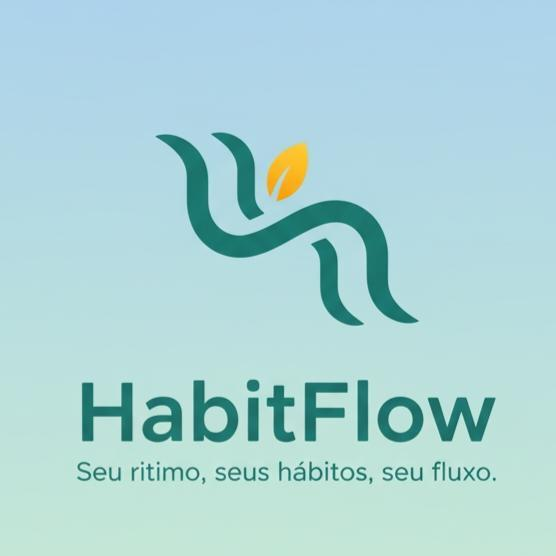

<div align="center">

  
  
  # HabitFlow
  
  **Seu companheiro diário para a construção de hábitos sólidos.**


</div>

---

## Índice

- [Sobre o Projeto](#sobre-o-projeto)
- [✨ Features](#-features)
- [🛠️ Tecnologias Utilizadas](#-tecnologias-utilizadas)
- [🚀 Começando](#-começando)
  - [Pré-requisitos](#pré-requisitos)
  - [Instalação](#instalação)
- [🔥 Uso](#-uso)
- [🤝 Como Contribuir](#-como-contribuir)
- [📄 Licença](#-licença)

---

## Sobre o Projeto

**HabitFlow** é um aplicativo móvel desenvolvido em Flutter projetado para ajudar usuários a criar, gerenciar e acompanhar seus hábitos diários de forma simples e eficaz.

O objetivo do projeto é fornecer uma ferramenta flexível onde o usuário não fique preso apenas a checklists binários. Com o HabitFlow, é possível definir metas numéricas (ex: ler 10 páginas) ou baseadas em duração (ex: meditar por 15 minutos), além de acompanhar o desempenho através de gráficos e estatísticas semanais. O app funciona totalmente offline, garantindo privacidade e rapidez no acesso aos dados.

---

## ✨ Features

- **Onboarding Intuitivo:** Apresentação das funcionalidades principais para novos usuários.
- **Gestão de Hábitos (CRUD):** Criação, edição e exclusão de hábitos personalizados.
- **Tipos de Metas Flexíveis:**
  - ✅ **Feito/Não Feito:** Checklist simples.
  - 🔢 **Meta Numérica:** Defina um valor alvo e uma unidade (ex: 2 Litros de água).
  - ⏱️ **Duração:** Defina um tempo alvo para a atividade.
- **Acompanhamento de Progresso:**
  - Visualização diária com barras de progresso.
  - Tela dedicada de estatísticas gerais.
  - Gráficos de performance semanal (últimos 7 dias).
  - Cartões de resumo para metas batidas e hábitos contínuos.
- **Notificações e Lembretes:** Agendamento de notificações locais para lembrar o usuário de realizar seus hábitos em horários específicos.
- **Persistência de Dados:** Todo o histórico é salvo localmente utilizando SQLite.

---

## 🛠️ Tecnologias Utilizadas

O projeto foi desenvolvido utilizando as seguintes tecnologias e bibliotecas:

- **[Flutter](https://flutter.dev/)** - Framework para desenvolvimento UI.
- **[Dart](https://dart.dev/)** - Linguagem de programação.
- **[Provider](https://pub.dev/packages/provider)** - Gerenciamento de estado.
- **[SQFlite](https://pub.dev/packages/sqflite)** - Banco de dados SQL local para persistência.
- **[Flutter Local Notifications](https://pub.dev/packages/flutter_local_notifications)** - Gerenciamento de notificações push locais.
- **[FL Chart](https://pub.dev/packages/fl_chart)** - Renderização de gráficos de progresso.
- **[Shared Preferences](https://pub.dev/packages/shared_preferences)** - Armazenamento de dados simples (flags de onboarding).
- **[Intl & Timezone](https://pub.dev/packages/timezone)** - Manipulação de datas e fusos horários.

---

## 🚀 Começando

Siga estas etapas para ter uma cópia do projeto em execução na sua máquina local.

### Pré-requisitos

Antes de começar, certifique-se de ter as seguintes ferramentas instaladas:

- **Flutter SDK**: [Guia de Instalação](https://docs.flutter.dev/get-started/install) (Versão recomendada: 3.5.0 ou superior).
- **Git**: Para clonar o repositório.
- **Android Studio** ou **VS Code**: Com as extensões do Flutter e Dart instaladas.
- Um emulador Android/iOS ou um dispositivo físico configurado.

### Instalação

1.  **Clone o repositório:**

    ```bash
    git clone [https://github.com/arielm11/habitflow.git](https://github.com/arielm11/habitflow.git)
    ```

2.  **Entre no diretório do projeto:**

    ```bash
    cd habitflow
    ```

3.  **Instale as dependências:**

    ```bash
    flutter pub get
    ```

4.  **Execute o aplicativo:**
    ```bash
    flutter run
    ```

---

## 🔥 Uso

Após rodar a aplicação:

1.  **Onboarding:** Na primeira execução, você verá telas de boas-vindas explicando o app.
2.  **Tela Inicial (Hoje):**
    - Toque no botão **"+"** (Floating Action Button) para adicionar um novo hábito.
    - Preencha o nome, descrição, escolha o tipo de meta e, opcionalmente, defina lembretes.
    - Na lista, marque o checkbox ou toque no card para atualizar o progresso (se for numérico).
    - Deslize um card para a direita para **Editar** ou para a esquerda para **Excluir**.
3.  **Tela de Progresso:**
    - Navegue pela barra inferior para a aba "Progresso".
    - Visualize o gráfico de desempenho da semana e o status de longo prazo dos seus hábitos.

---

## 🤝 Como Contribuir

Contribuições são o que tornam a comunidade open source um lugar incrível para aprender, inspirar e criar. Qualquer contribuição que você fizer será **muito apreciada**.

1.  Faça um Fork do projeto.
2.  Crie uma Branch para sua Feature (`git checkout -b feature/NovaFeature`).
3.  Faça o Commit de suas mudanças (`git commit -m 'Adicionando uma nova feature'`).
4.  Faça o Push para a Branch (`git push origin feature/NovaFeature`).
5.  Abra um Pull Request.

---

## 📄 Licença

Distribuído sob a licença MIT. Veja `LICENSE` para mais informações.

---

<div align="center">
  Feito por arielm11 e willian-silva01
</div>
